  <picture>
    <source media="(prefers-color-scheme: dark)" srcset="assets/banner-dark.svg" />
    <source media="(prefers-color-scheme: light)" srcset="assets/banner-light.svg" />
    
  </picture>

 

  <strong>Full-stack robotics R&amp;D — from bare-metal drivers to autonomous systems.</strong> 
  机器人全栈研发 —— 从底层硬件接口到上层自主系统。

 

---

## Tech Stack / 技术栈

Extracted from production code across our repositories. 以下技术栈提取自各仓库的实际生产代码。

| Domain | Technologies |
| --- | --- |
| **Languages** |      |
| **Robot Middleware** |      |
| **Perception & Navigation** |     |
| **Embedded & Hardware** |     |
| **Backend & AI** |      |
| **Frontend** |      |
| **Engineering & DevOps** |       |

 

---

## Projects / 项目

### Robotics Core · 机器人核心

Hardware-near software: drivers, firmware, and the ROS 2 workspace that ties them together. 贴近硬件的一层：驱动、固件，以及把它们组织起来的 ROS 2 工作空间。

| Repository | Description |
| --- | --- |
| [`omrobot`](https://github.com/ChiefTechLabs/omrobot) | ROS 2 Humble workspace for OMRobot — mobile platform with robotic arm, omnidirectional chassis, and LiDAR SLAM navigation |
| [`dais_motor`](https://github.com/ChiefTechLabs/dais_motor) | Pure C++ Modbus RTU driver for the D-AIS48025A-R servo drive — zero ROS dependency |
| [`realman_arm`](https://github.com/ChiefTechLabs/realman_arm) | Pure C++ wrapper for the RealMan RM_API2 SDK — arm motion, gripper, and state monitoring |
| [`m65_chassis`](https://github.com/ChiefTechLabs/m65_chassis) | Pure C++ serial driver for the M65 omnidirectional chassis — zero ROS dependency |
| [`photogate`](https://github.com/ChiefTechLabs/photogate) | ESP32-C3 photogate sensor — firmware, C++ driver, and ros2_control plugin for OMRobot |

### AI & Automation · AI 与自动化

GenAI-powered pipelines that plan, generate, and ship content autonomously. 由 GenAI 驱动的自动化流水线。

| Repository | Description |
| --- | --- |
| [`geo`](https://github.com/ChiefTechLabs/geo) | GEO automation platform — GenAI-powered content pipeline for generative engine optimization: plan, generate, optimize, review, publish |

### Developer Tools · 开发工具

Agent skills and CLI tooling that make our daily workflow faster. 提升日常研发效率的 Agent 技能与命令行工具。

| Repository | Description |
| --- | --- |
| [`lark-skills`](https://github.com/ChiefTechLabs/lark-skills) | AI agent skills for lark-cli — natural-language control of Lark/Feishu: IM, docs, sheets, calendar, wiki, approval, and more |
| [`weekly-report`](https://github.com/ChiefTechLabs/weekly-report) | OpenCode skill — auto-generate structured weekly reports from OpenCode session history across projects |
| [`printer`](https://github.com/ChiefTechLabs/printer) | OpenCode skill — print documents, photos, and web pages via CUPS/IPP with automatic printer discovery |

 

---

## Join Us / 加入我们

  

    We hire engineers who are fluent at every layer — from registers to route planning. 
    我们在寻找打通每一层的工程师 —— 既读得懂寄存器，也调得好路径规划。
  

  

 

---

  <strong>ChiefTechLabs</strong> · Full-stack robotics R&amp;D · <a href="https://github.com/ChiefTechLabs">github.com/ChiefTechLabs</a>

